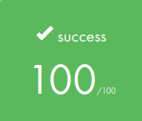

# 42-so_long

This is the first graphic project at 42, a small 2D game. <br>

SoLong is an individual project at 42 that requires us to create a very small 2D game. It is built to make you work with textures, sprites and some very basic gameplay elements using MinilibX, a simple X-Window (X11R6) programming API in C, designed for students, suitable for X-beginners.

## Gameplay


## Badge


## Skills

- Imperative programming
- Graphics 

## My grade



# 42-so_long
The aim of this project is to code a 2D Game :D <br>
## Use:
🚧
Build functions and project Execution:<br/>
```
$ make && make run
```
🚿
Clean Obj files:<br/>
```
$ make clean
```
🚿 🚿
Clean All (obj files + binary):<br/>
```
$ make fclean
```
🚿 🚧
Clean All + build:<br/>
```
$ make re
```
<br/>See Makefile <br />

### Made with: <br/>

### Alexandre Zamarion
<div style="display: inline_block">
 <a href="https://github.com/alezamarion" target="_blank"></a>
 <a href="https://www.linkedin.com/in/alexandre-zamarion-cepeda-a3766323a/" target="_blank"></a> 
</div>

### Jorge Alves
<div style="display: inline_block">
 <a href="https://github.com/jorgeedualves/jorgeedualves" target="_blank"></a>
 <a href="https://www.linkedin.com/in/jorge-eduardo-alves-094b4331/" target="_blank"></a> 
</div>

### Alfredo Neto
<div style="display: inline_block">
 <a href="https://github.com/Alfredo-Neto" target="_blank"></a>
 <a href="https://www.linkedin.com/in/alfredo-neto-a2515814b/" target="_blank"></a> 
</div>


